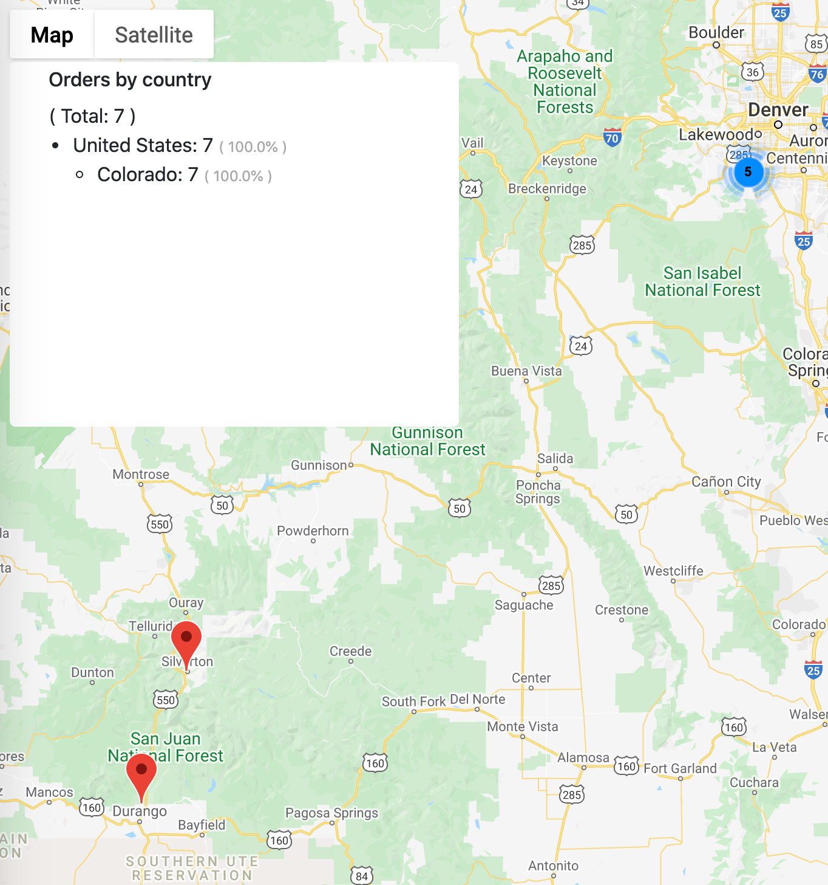

# Shopify Order Map

Shopify Order map is a little script in *nodejs* that outputs all the orders from a shopify store to a google map.
Orders are grouped using google maps MarkerClusterer. Few Stats with number are available on top of the page, grouped by states.

</img>

## Installation
Run:
```
  npm install
```

## Configuration

1. Update your google map API KEY in the last part of `map-template.html`
2. Customize the `map-template.html` and style to look the way you want
3. Update your shopify store name and api key in `src/index.js`. Create a [private app](https://shopify.dev/tutorials/authenticate-a-private-app-with-shopify-admin) on shopify.
   ```typescript
    export const shopify = new Shopify({
      shopName: 'SHOP-NAME',
      apiKey: 'API-KEY',
      password: 'API-PASSWORD',
      apiVersion: '2020-01'
    });
   ```

## Run

```
  node src/index.js
```
The output is in `output/map.html`
Configure a timer on a live server to run this script and copy/paste the ouput into a web shared folder.